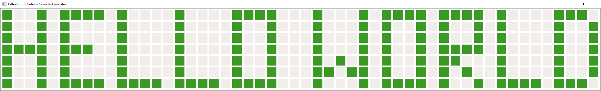
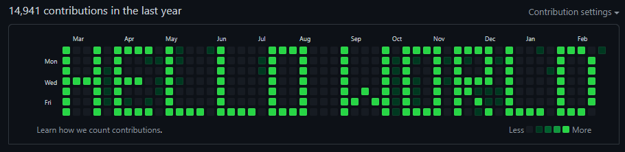

# custom-contribution-graph-generator

## Instructions
1. Clone this repo `git clone https://github.com/MichelDequick/custom-contribution-graph-generator.git`
2. Install the requirements `pip install -r custom-contribution-graph/requirements.txt`
3. Run the program `python custom-contribution-graph-generator`
4. Draw your design in the provided UI and press ENTER
5. While the commits are generating
    - Create a github repository
    - Remove the current origin `git remote remove origin`
    - Add your new repository as the new origin `git add origin <your repo>`
7. Push your clone back to github, done!

## Parameters
```
python custom-contribution-graph-generator <custom repo name>
    positional arguments:
    repo_name             repository to create

    optional arguments:
    -h, --help            show this help message and exit
    
    -m MAX_COMMITS_A_DAY, --max-commits-a-day MAX_COMMITS_A_DAY
                            Maximum amount of commits a day 
                            (Default: 100)

    -y YEAR, --year YEAR  specify a specific year 
                            Example: 2010, 2018, 2020 
                            (Default: one year ago today)
```

## Example
### UI

### Result

