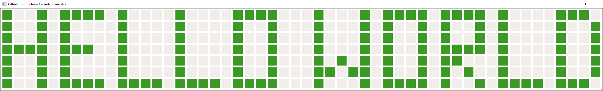

# custom-contribution-graph

## Instructions
1. Fork this repository
2. Clone your fork
2. Install the requirements `pip install -r custom-contribution-graph/requirements.txt`
3. Run the program `python custom-contribution-graph-generator`
4. Draw your design in the provided UI and press ENTER
5. Push your clone back to github, done!

## Example
### UI

### Result

